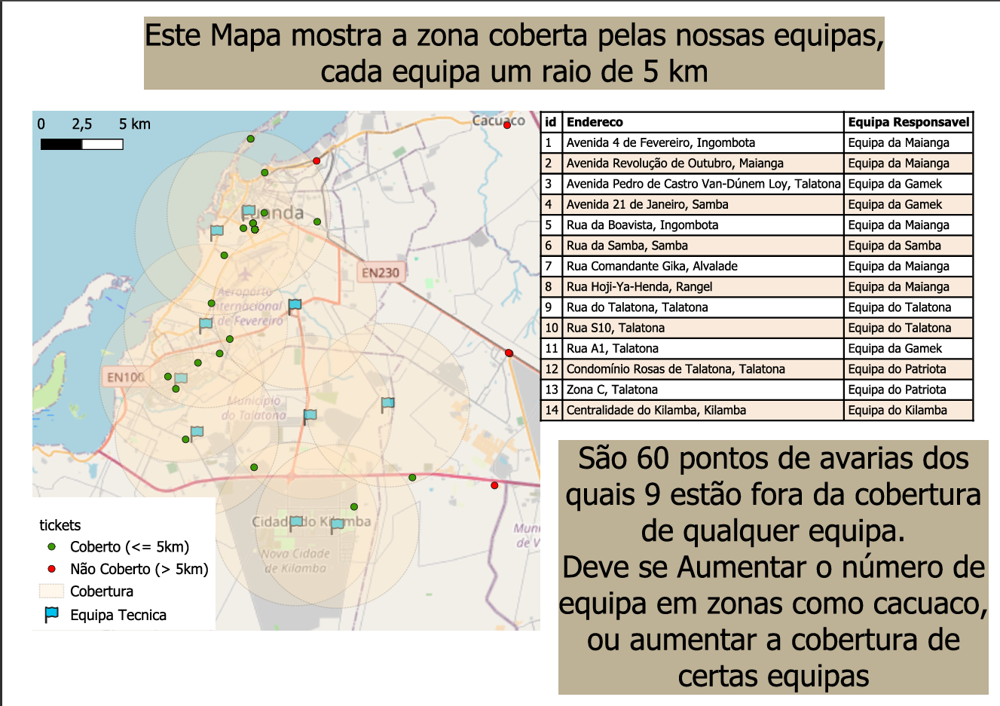

# Análise de Cobertura e Distâncias (Simulação Operacional)

Construção de um cenário operacional — equipas técnicas e tickets de avaria — sobre a base geográfica do Projecto 1, com análise de cobertura, distâncias e associação ticket→equipa feita tanto no QGIS como directamente em SQL espacial (PostGIS).

## Objectivo

Simular o tipo de análise que suporta decisões operacionais no terreno: até onde chega a cobertura de uma equipa técnica, que tickets ficam fora dessa cobertura, e qual a equipa mais próxima de cada ocorrência — combinando edição manual no QGIS, geocoding via API, e consultas espaciais em SQL.



## Fluxo de dados

```
Equipas Técnicas                       Tickets/Avarias
(clicadas manualmente no QGIS,         (moradas em texto → geocoding
 GeoPackage EPSG:32733)                 via API Nominatim/OpenStreetMap)
        ↓                                       ↓
DB Manager (Import Layer/File)          Script Python (psycopg2)
        ↓                                       ↓
        └───────────→  PostgreSQL + PostGIS  ←───────────┘
                     (tabelas em geometry, EPSG:32733)
                              ↓
                  Queries SQL espaciais
            (buffers, distâncias, spatial join)
                              ↓
                    QGIS (mapa temático)
                              ↓
                       Layout PDF
```

## O que foi feito

- **Equipas técnicas (8–12 pontos):** criadas directamente no QGIS como camada vectorial (`Layer > Create Layer > New GeoPackage Layer`), em **EPSG:32733 (UTM 33S)**, marcadas manualmente sobre o mapa em zonas distintas de Luanda (Maianga, Talatona, Viana, Cazenga, Cacuaco, Kilamba, Belas, entre outras). Importadas para o PostGIS via `DB Manager > Import Layer/File`.
- **Tickets/avarias (40–60 pontos):** criados a partir de **moradas em texto**, geocodificadas via **API Nominatim (OpenStreetMap)** num script Python, e inseridos directamente na base de dados PostGIS já projectados em EPSG:32733.
- **Consistência de sistema de coordenadas:** todas as tabelas (`equipas_tecnicas`, `tickets`) foram alinhadas para `geometry(Point, 32733)` — cálculos de distância e cobertura em **metros**, sem depender do tipo `geography` (que exige EPSG:4326).
- **Análise de cobertura:** buffers de equipas técnicas (visual, no QGIS) e a mesma análise replicada em SQL (`ST_DWithin`) para identificar tickets dentro/fora da cobertura.
- **Distance Matrix:** distância (em km) de cada ticket a cada equipa, calculada em SQL (`ST_Distance`).
- **Spatial Join:** associação de cada ticket à equipa tecnicamente mais próxima, usando o operador de vizinhança `<->` do PostGIS (mais eficiente que calcular todas as distâncias e depois ordenar).
- **Contagem de tickets por equipa mais próxima**, para identificar zonas com maior carga operacional.
- **Mapa temático:** tickets classificados visualmente como "dentro" ou "fora" da cobertura de 5km, sobrepostos aos buffers das equipas.
- **Layout de apresentação:** Print Layout do QGIS exportado em PDF, com título, legenda, escala, seta do norte e rodapé com metadados.

## Tecnologias e ferramentas

| Categoria | Ferramenta |
|---|---|
| Criação de dados (equipas) | QGIS (edição vectorial manual) |
| Geocoding (tickets) | API Nominatim (OpenStreetMap) |
| Base de dados | PostgreSQL + PostGIS (Docker) |
| Inserção de dados | Python (`psycopg2`, `requests`) |
| Análise espacial | SQL (PostGIS): `ST_DWithin`, `ST_Distance`, `<->` |
| Sistema de coordenadas | EPSG:32733 (UTM 33S) — consistente em todas as tabelas |
| Visualização | QGIS |

## Estrutura do repositório

```
projecto-2-cobertura-distancias/
├── README.md
├── scripts/
│   └── geocode_tickets.py             # geocoding de moradas + 
tabelas
├── qgis/
│   └── projeto_2.qgz
└── outputs/
    ├── mapa_cobertura_5km.pdf
    └── conclusoes.pdf                  # zonas com pior cobertura, distância média, etc.
```

## Como reproduzir

```bash
# 1. Base de dados já criada no Projecto 1 (gis_test, extensão PostGIS activa)

# 2. Criar e importar a camada de equipas técnicas
#    - No QGIS: Layer > Create Layer > New GeoPackage Layer (EPSG:32733)
#    - Marcar os pontos manualmente sobre o mapa
#    - DB Manager > Import Layer/File > equipas_tecnicas

# 3. Geocodificar e inserir os tickets
python scripts/geocode_tickets.py

# 4. Corrigir sistema de coordenadas, se necessário (garantir consistência 32733)
psql -U postgres -d gis_test -f sql/schema_equipas_tickets.sql


# 6. Abrir o projecto QGIS para o mapa temático e layout
qgis qgis/projeto_2.qgz
```

## Notas técnicas

- **Consistência de SRID:** o maior cuidado deste projecto foi garantir que todas as geometrias usam o mesmo sistema de coordenadas (EPSG:32733) e o mesmo tipo (`geometry`, não `geography`) — misturar os dois provoca erros de cálculo de distância (`geography` só aceita EPSG:4326). Todas as inserções via API foram explicitamente reprojectadas (`ST_Transform`) antes de entrarem na base de dados.
- **Nomes de colunas:** campos criados via interface do QGIS podem ficar com maiúsculas (ex.: `Nome`), exigindo aspas duplas em SQL (`e."Nome"`) ou renomeação prévia (`ALTER TABLE ... RENAME COLUMN`).
- Este projecto reutiliza a base de dados do **Projecto 1** e prepara o terreno para o **Projecto 3**, que adiciona limites municipais, análise de hotspots, cálculo de rotas sobre a rede viária real (osmnx/networkx) e um dashboard executivo em Power BI ligado à mesma base de dados.

---
**Autor:** Dário Nzita
**LinkedIn:** linkedin.com/in/dário-nzita
**GitHub:** github.com/DARIONZITA